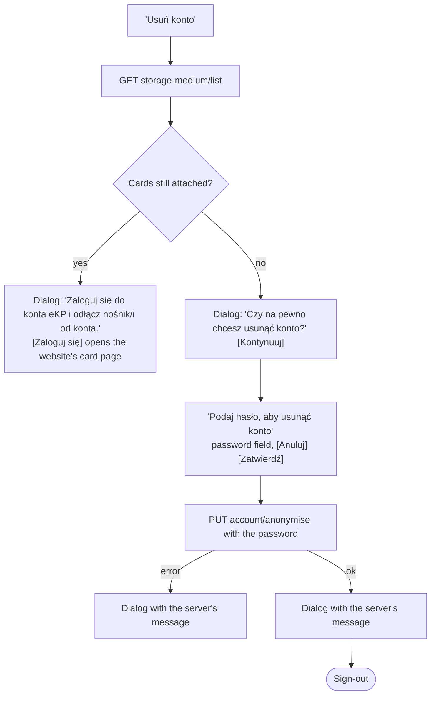

# Account: the "More" tab

Source: the menu `MoreComponent` (module 1846), `MyProfile` (1859), `ContactScreen` (1861),
`RegulationScreen` (1862), invoices (1875–1880, 1907), `DeleteAccountScreen` (2035), the account
strings (1847, 1860, 1876, 1912).

## The menu (`MoreContainer`)

The header shows the user's photo and "Witaj, **first name last name**". Below it, a plain list of
rows: an icon, a title and a chevron.

| Row | Leads to |
|---|---|
| Moje konto | `MyProfile` |
| Faktury | `Invoices` |
| Regulaminy | `Regulation` |
| Kontakt | `Contact` |
| Deklaracja dostępności | `Accessibility` (see [auth.md](./auth.md#accessibility-declaration)) |
| Usuń konto | `DeleteAccount` |
| Wyloguj | Signs out at once, without asking (see [startup-and-session.md](./startup-and-session.md#sign-out)) |

There is no settings screen: no language, theme or notification options exist in the app.

## My account (`MyProfile`)

Title "MOJE KONTO", on the photo background. Three white cards, each with its own save button and
its own request, so they are saved independently.

### Photo

The current photo in a circle (or a placeholder), a picker button "ZMIEŃ ZDJĘCIE" (camera or
library; JPG, PNG or WebP up to 5 MB) and a button "Zapisz zdjęcie".

"Zapisz zdjęcie" uploads to `account/photo`. Success: the user data is reloaded and a dialog says
"Zdjęcie zostało zmienione". Failure: the server's message.

### Personal data

| Field | Editable | Rules |
|---|---|---|
| Imię | Yes | Required |
| Nazwisko | Yes | Required |
| PESEL | No | |
| Data urodzenia (RRRR-MM-DD) | No | |
| E-mail | No | |
| Numer telefonu | Yes | Digits only |
| Adres zamieszkania | Yes | The address block: town, postcode, street (by search), building, flat |

The address is required for users who have an mKKM card. For everyone else it may be left entirely
empty, but not half filled.

"ZAPISZ ZMIANY" posts the form to `account/user-data`. Success (204): dialog "Dane zostały
zaktualizowane", and the store's user data is updated from the form. Failure: the server's message,
or "Proszę podać wymagane dane".

### Password

The password policy box, then "Stare hasło", "Nowe hasło" and "Powtórz hasło". "ZMIEŃ HASŁO" posts
to `auth/change-password`.

- The two new passwords differ: "Hasła nie są identyczne".
- Success: "Hasło zostało zmienione", and the three fields are cleared. The user stays signed in.
- Failure: the server's message.

## Contact (`Contact`)

A paragraph saying whom to contact about registration or purchases, then two rows: "Numer telefonu"
with the MPK helpline and "Email" with the support address. The values are links: the phone number
opens the dialler, the address the mail client.

## Regulations (`Regulation`)

Four documents, each a row with its title and a "Podgląd" button that opens the PDF in the browser.
The addresses come from the app configuration, with defaults built in.

| Title |
|---|
| Regulamin elektronicznego konta pasażera |
| Regulamin biletu 5+1 |
| Regulamin internetowej sprzedaży biletów okresowych |
| Obowiązek informacyjny |

## Invoices

### List (`Invoices`)

This screen uses the newer, simpler page scaffold (`BasePage`): a fixed blue header with a back
arrow and the title "Faktury", then white content.

- A notice at the top: since 4 March 2024, invoices for tickets are issued only by e-mail to the
  transport authority.
- A paged list from `invoices`, fifteen at a time, newest first. More are loaded when the user drags at
  the end of the list, with a spinner in the footer. Pull-to-refresh starts over, as does returning to the
  screen.
- Each invoice: the document number, "Numer karty: …", the related document when there is one
  ("Dokument powiązany"), the amount, the date and the time, and two small buttons.

| Button | Does |
|---|---|
| Pobierz | Downloads the PDF into the device's downloads through the system download manager. The button shows a spinner meanwhile. An alert reports the result and offers "WYŚWIETL" to open the file. On Android 9 and older the storage permission is requested first. |
| Podgląd | Opens `PreviewPdf` |

- Failure: "Wystąpił błąd, podczas pobierania faktur".

### Preview (`PreviewPdf`)

Title "Faktura". The PDF is loaded with the session token and rendered in the app, full width, with
a spinner while loading. Failure: "Wystąpił problem z otwarciem dokumentu, spróbuj ponownie później".

### Creating an invoice for a ticket

Reached only from ticket details ("Utwórz fakturę", see
[tickets.md](./tickets.md#ticket-details-ticketdetails)); the route is `InvoicesCreationForm`. Title
"Generuj fakture". It loads the country list and the ticket's owner
(`customers/transaction-owner/{transactionCode}`).

The form has two halves, recipient and payer.

**Odbiorca (recipient)**

1. A choice: "Osoba fizyczna" or "Firma".
2. For a person, a second choice under "Dane do faktury:": "Moje dane" (the account's data, fields
   locked) or "Inne" (fields empty and editable).
3. For a person: Imię, Nazwisko, then the contact and address block.
4. For a company: NIP and a "Wyszukaj" button. The search asks `customers/company` for that NIP and
   lists the matches under "Wybierz z listy", or shows "Brak wyników dla podanych filtrów". Picking a
   match is enough: no further fields are needed. Without a match the form opens up for manual entry:
   Nazwa, the contact and address block, KRS, REGON.

The contact and address block: E-mail, Numer telefonu, Kraj (a dropdown), Miejscowość, Kod pocztowy
(`99-999`), Ulica, Numer budynku, Numer lokalu.

**Płatnik (payer)**

A checkbox "Dane takie jak odbiorcy", ticked by default. Unticking it reveals the same structure
again for the payer: person or company, NIP search, the same fields.

**Validation**, shown under each field after the first submit:

| Message | When |
|---|---|
| Pole nie może być puste | A required field is empty |
| Podaj poprawny NIP | The NIP fails its checksum (a leading "PL" is accepted and removed) |
| Podaj poprawny adres e-mail | |
| Podaj poprawny kod pocztowy | |

"Generuj fakture" posts everything to `invoices/create`. Success: the ticket details are reloaded
and a dialog says "Pomyślnie wygenerowano fakture"; the details screen then offers "Pobierz fakturę".
Failure: the server's message.

A second route, `InvoiceCreation`, exists in the More stack and loads the countries and the customer,
but nothing navigates to it in this build.

## Deleting the account (`DeleteAccount`)

Title "Usunięcie konta". The screen starts with an explanation and one button.

> Aplikacja mKKM tożsama jest z kontem eKP. Usunięcie konta mKKM spowoduje jednoczesne usunięcie
> konta na stronie www.ekp.mpk.krakow.pl. Dostęp do zakupionych biletów, faktur zostanie utracony.
> Obecnie tylko za pomocą konta eKP można zakupić bilet przez Internet na nośnik plastikowy.

- The account cannot be deleted while a card is attached to it, and cards can only be detached on
  the website. The app checks this first and sends the user there. (Which branch of that check shows
  which dialog was inferred from the texts.)
- The password field has the context menu disabled, so nothing can be pasted into it.
- After a successful deletion the dialog's button reads "Wyloguj", and closing it signs the user
  out.
