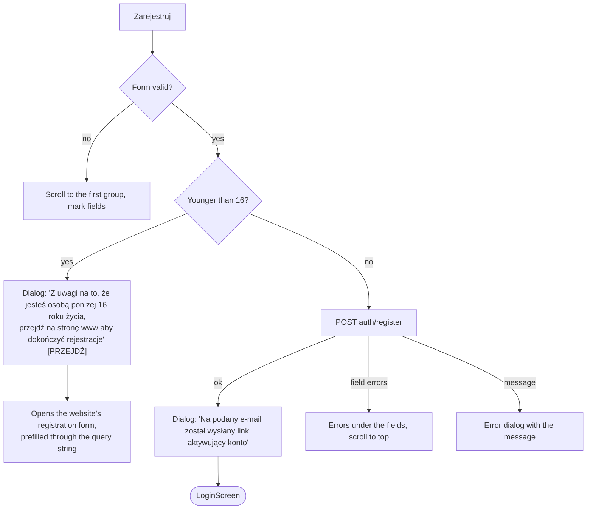

# Signed-out flows

Source: `LoginScreen` (module 1480), `RegisterScreen` (1670), `PasswordPolicy` (1690),
`ResetPasswordScreen` (1691), `Accessibility` (1697), validation (1494).

All four screens sit on the photo background (`bg`) with a white rounded card holding the form.

## Login

```
        [ logo ]
┌──────────────────────────┐
│        LOGOWANIE         │
│ ●- - - - - - - - - - - -●│   dotted divider, a "ticket stub" motif
│ E-mail                   │
│ Hasło                    │
│ ☐ Zapamiętaj logowanie   │
│ [      ZALOGUJ SIĘ     ] │
│ Nie masz konta? Zarejestruj się
│ Zapomniałem hasła        │
│ Deklaracja dostępności   │
└──────────────────────────┘
```

| Control | Behaviour |
|---|---|
| E-mail | Required, must look like an e-mail ("Zły e-mail"). E-mail keyboard, no capitalisation, autofill hint. |
| Hasło | Required ("Złe hasło"). Hidden, autofill hint. |
| Zapamiętaj logowanie | Decides whether the session survives a restart. See [startup-and-session.md](./startup-and-session.md). |
| ZALOGUJ SIĘ | Validates, hides the keyboard, `POST auth/login` with the form, device id and device name. |
| Nie masz konta? Zarejestruj się | → `RegisterScreen` |
| Zapomniałem hasła | → `ResetPasswordScreen` |
| Deklaracja dostępności | → `Accessibility` |

Outcomes of the login:

- Invalid form: dialog "Niepoprawne dane", no request.
- No token in the answer: dialog with the server's message, or "Niepoprawne dane".
- Token: stored, the remember-me flag stored, then `GET account/user-data`, then the root is reset to
  `App`.

The header spinner covers the screen while the request runs.

### E-mail links

The login screen is where links from e-mails arrive. It listens for incoming URLs and also reads the
launch URL whenever the app becomes active.

| Link | Result |
|---|---|
| Activation (`…/activate,<token>.html`) | `POST auth/activate` with the token, behind the spinner. Success dialog "Konto zostało aktywowane. Możesz się teraz zalogować", or an error dialog with the server's message. The user stays on the login. |
| Password reset (`…/reset,<token>.html`) | → `ResetPasswordScreen` with the link as a parameter |

The token is whatever stands between the comma and the following dot.

## Registration

Title "ZAŁÓŻ NOWE KONTO", back arrow to the login. One long scrolling form in three headed groups,
followed by consents.

| Group | Field | Rules |
|---|---|---|
| Dane osobowe | Imię | Required ("Proszę podać imię") |
| | Nazwisko | Required ("Proszę podać nazwisko") |
| | PESEL | Eleven digits, numeric keyboard, checksum validated ("Niepoprawny PESEL"). A valid PESEL fills the birth date. |
| | ☐ Nie posiadam PESEL | Disables PESEL and enables the birth date |
| | Data urodzenia (RRRR-MM-DD) | Only when there is no PESEL. Focusing the field opens a date picker (1900-01-01 to today) instead of the keyboard. |
| Dane kontaktowe | E-mail | Required, e-mail format, lower-cased while typing |
| | Powtórz e-mail | Must match ("E-maile nie są identyczne") |
| Hasło | (policy box) | See below |
| | Hasło | Required |
| | Powtórz hasło | Must match ("Hasła nie są identyczne") |

Below the fields:

- **Consents** from `GET auth/marketing-consents`, fetched when the screen opens (failure pops the
  screen). Each is a checkbox with the server's text; the word "Regulamin" opens the regulations
  document. Required consents left unchecked show "Wymagane jest wyrażenie zgody" after the first
  submit attempt.
- **A long data-protection notice** in small print.
- **Zarejestruj**, in the bottom safe area.

### Password policy box

A blue box with white text built from `GET auth/password-policy` (the numbers below are examples):

```
Wymagania hasła:
- min. liczba znaków 8
- min. liczba cyfr 1
- min. liczba małych liter 1
- min. liczba wielkich liter 1
- min. 1 znak specjalny np. !@#$%^&*()_+-={}[]:";|/?,.
```

Lines appear only for the rules the server enables. The same box is used on the reset and profile
screens.

### Submitting



The under-16 branch never calls the API: registration of minors is only possible on the website. The
age is taken from the birth date (from the PESEL or the picker).

## Password reset

Title "RESETOWANIE HASŁA". The same screen has two states, chosen by whether it holds a token.

**Without a token** (opened from the login):

- Text: "Podaj adres e-mail użyty przy rejestracji, aby ustawić nowe hasło do swojego konta".
- E-mail field (required, e-mail format).
- "Zresetuj hasło" → `POST auth/reset-password-link-request`.
- On success, a dialog that does not reveal whether the address exists ("Jeżeli podałeś prawidłowy
  adres e-mail to wysłaliśmy na niego wiadomość z linkiem…"), then back to the login.

**With a token** (opened from the e-mail link, or a link arriving while the screen is open):

- The password policy box.
- "Hasło" and "Powtórz hasło".
- "Zresetuj hasło" → `POST auth/reset-password` with the new password and the token.
- Client checks: "Wpisz hasło" when empty, "Hasła nie są identyczne" when different.
- On success, the login screen with the dialog "Twoje hasło zostało zmienione". On failure, the
  server's message, field errors under the fields, or "Wystąpił nieznany błąd".

## Accessibility declaration

Title "Deklaracja dostępności", back arrow. The screen downloads the HTML of the declaration (the URL
comes from the app configuration) and renders it inside a WebView that grows to the height of its
content, so it reads as part of the page. Links open in the browser. While loading there is a
spinner; on failure, "Coś poszło nie tak, spróbuj później", and the download is tried again when the
connection returns.

The same screen is reachable from the login and from the More menu.

## Validation rules

Shared by every form in the app (`checkValid`):

| Rule | Check |
|---|---|
| `email` | Pattern match |
| `pesel` | Eleven digits, a real date for the century coding, checksum with weights 9 7 3 1 9 7 3 1 9 7 |
| `nip` | Ten digits after removing separators, checksum modulo 11 |
| `codePost` | `99-999` |
| `phone` | Pattern match |
| `passport`, `serialDocument`, `text` | Pattern match |
| `any` | Non-empty |
| a number | Minimum length |

Password complaints raised by the client mirror the policy: "Hasło powinno zawierać N znaków",
"…liczby", "…małe litery", "…wielkie litery", "…znaki specjalne".
