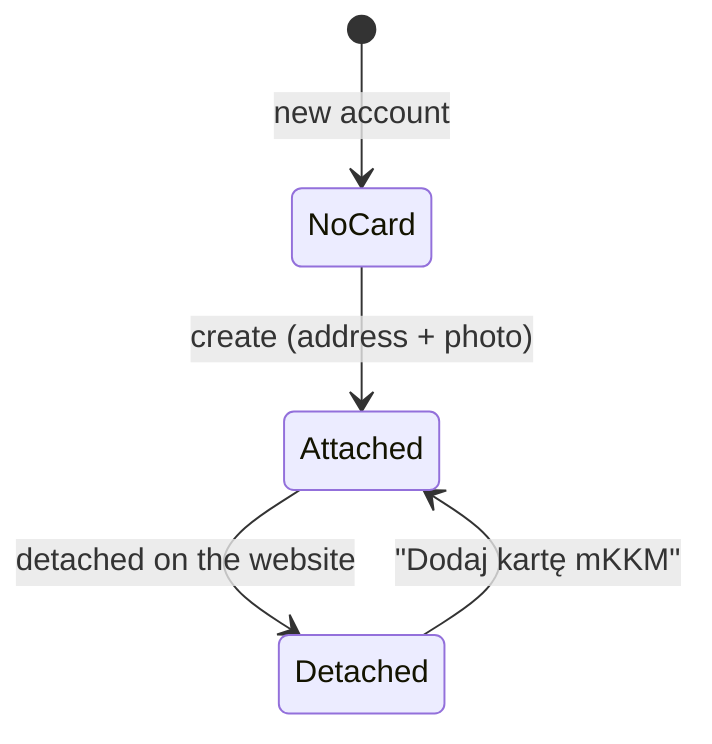
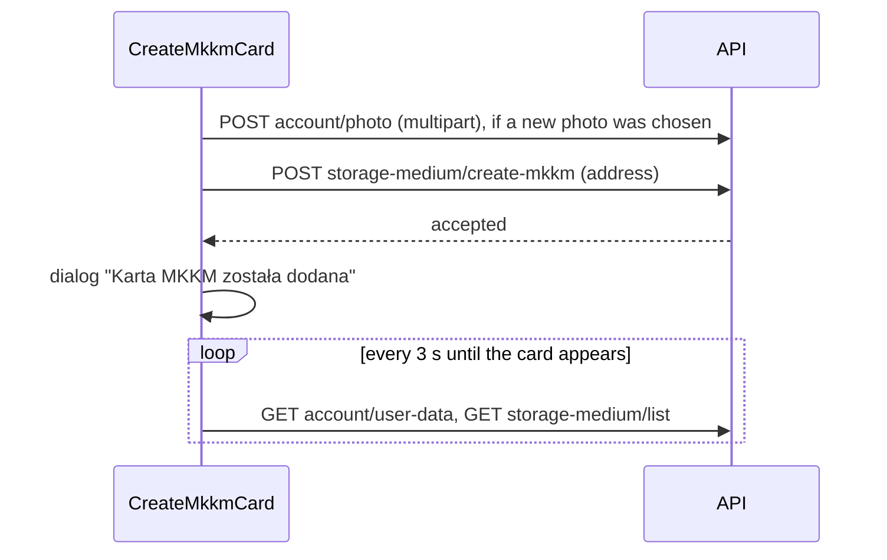

# The mKKM card

Source: `CardsScreen` (module 1866), `CardItem` (1867), `CreateMkkmCardScreen` (1868),
`CardTicketsScreen` (1869), `CardTicketReturnScreen` (1840), the card strings (1841), `Address`
(1525), `DropFile` (1519).

Mobile tickets are stored on a virtual card, the mKKM. An account starts without one, and the card
can later be detached from the account on the website. Until an attached card exists, the Tickets
tab and both purchase flows are closed (see [navigation.md](./navigation.md)).



## My card (`Cards`)

Title "MOJA KARTA MKKM", reached from the Home tile. Loads the storage media and the user data, on
opening and on pull-to-refresh.

| State | What the screen shows |
|---|---|
| Card attached | The card, and under it a tile "Bilety zapisane na karcie" / "Dotknij, aby przejść do listy biletów" → `CardTickets` |
| Card being created | A large spinner (the app is polling, see below) |
| No card | The same text and button as a detached card; the button opens `CreateMkkmCard` |
| Card detached | "Twoja mobilna Krakowska Karta Miejska jest odłączona od konta, dodaj ją ponownie, aby uzyskać dostęp do zakupów i zarządzania biletami zapisanymi na tej karcie" and a button "Dodaj kartę mKKM" |

**The card** is a white panel: the card type's name as a heading, a divider, then the user's photo
in a circle beside three lines: the name, "Numer klienta" with the customer code, and "Status
mieszkańca" with "Tak" in blue or "Nie" in red.

**Reattaching** posts to `storage-medium/create` with the existing customer code and the mKKM card
type (code 8). Success: dialog "Karta mKKM została podłączona do konta", and closing it reloads the
screen. Failure: the server's message.

## Creating the card (`CreateMkkmCard`)

Title "Nowa karta MKKM", on the photo background with a white form card.

1. An explanation: the mKKM is needed to buy electronic tickets that can only be used on a mobile
   device.
2. **Address** (all required):

   | Field | Notes |
   |---|---|
   | Miejscowość | Up to 255 characters |
   | Kod pocztowy | Masked `99-999`, numeric keypad |
   | Ulica | Not typed directly: tapping it opens a search list fed by `account/street-autocomplete`, queried half a second after the user stops typing, at most 15 results |
   | Numer budynku | |
   | Numer lokalu | Optional |

3. **Photo.** The current profile photo in a circle, or a placeholder, with a button "DODAJ ZDJĘCIE"
   that offers "Zrób zdjęcie" and "Wybierz zdjęcie". Allowed: JPG, PNG, WebP, up to 5 MB. A photo is
   mandatory ("Zdjęcie wymagane"), unless the account already has one.
4. The photo requirements in a grey italic box: an ID-style photo, evenly lit face on a light
   background, no headwear or sunglasses, the face filling about two thirds of the picture.
5. "DODAJ" in the bottom safe area, then the data-protection notice.

Submitting:



The card is created asynchronously on the server, which is why the app polls. While it does, the
"My card" screen shows the spinner. Closing the success dialog reloads the data and goes back.

## Tickets on the card (`CardTickets`)

Title "BILETY ZAPISANE NA KARCIE". This is the server's view of everything stored on the medium,
including tickets bought on the website, as opposed to the mobile ticket list.

- A two-part switch at the top: "AKTUALNE" and "ARCHWIWALNE". Each loads
  `tickets?customerCode=…&validity=Current|Past`.
- Each ticket is a dark panel: the line or lines with a vehicle icon ("Wszystkie linie" for line
  1000), "Ważny od" and "Ważny do" with dates, and "więcej →" leading to `TicketDetails` when the
  ticket has a transaction code.
- Empty: "Brak biletów na tym nośniku".
- Pull-to-refresh reloads the current part.

## Returning a card ticket (`CardTicketReturn`): present but unreachable

The route is registered in the Home stack and the screen is complete, but nothing in this build
navigates to it. The card ticket list also carries a confirmation dialog for it ("Potwierdź czy na
pewno chcesz zwrócić bilet?", "Tak" / "Nie") whose handler does not exist. It reads as a feature that
was switched off, or one that is not finished. It is described here because the strings and the
layout are a ready design for returning a ticket addressed by its `ticketGuid`.

```
┌──────────────────────────────────────────┐
│ Zwrot za pośrednictwem systemy tpay      │
│ Data zwrotu      2026-10-15    [ Zmień ] │
│ Kwota do zwrotu: 42,50 zł                │
│ [ Anuluj ]                    [ Zwróć ]  │
└──────────────────────────────────────────┘
```

- The amount is calculated as soon as the screen opens, for today (or the ticket's start date), and
  again whenever the date changes: `POST ticket-returns/calculate` with the ticket id and the date.
- The date picker has the same limits as the return screen in
  [tickets.md](./tickets.md#returning-a-ticket-ticketrefund).
- "Zwróć" posts to `ticket-returns`, reloads the card tickets or the subscription and the ticket
  list, goes back and shows "Bilet został pomyślnie zwrócony".
- "Anuluj" goes back.
