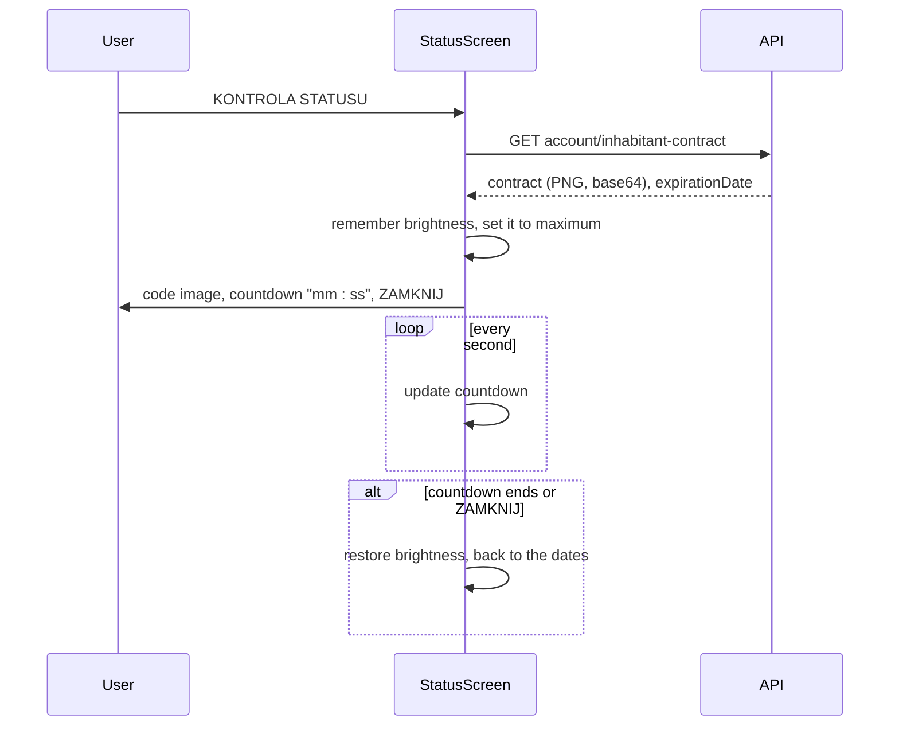

# Home, Karta Krakowska status, stop departures

Source: `DashboardScreen` (module 1766), the tile `NavElement` (1768), `StatusScreen` (1863), stop
departures (1769, 1771).

## Home (`Dashboard`)

The official Home is a launcher: a header and a two-column grid of white tiles. It shows no ticket.

```
[logo]  KRAKOWSKA KARTA MIEJSKA              (avatar)
                            Numer klienta: 12345678
┌──────────────┐ ┌──────────────┐
│ ▣            │ │ ▤            │
│ BILETY       │ │ MOJA KARTA   │
│              │ │ MKKM         │
└──────────────┘ └──────────────┘
┌──────────────┐ ┌──────────────┐
│ ▥            │ │ 5+1          │
│ STATUS KARTY │ │ BILET 5+1    │
│ KRAKOWSKIEJ  │ │              │
└──────────────┘ └──────────────┘
```

**Header.** Blue, with the logo and the title on the left and the user's photo in a circle on the
right (a placeholder icon without a photo). Tapping the photo opens `More` → `MyProfile`. Under the
header, right-aligned in bold white: "Numer klienta:" and the mKKM customer code, only when the user
has an mKKM card.

**On opening** the screen runs the update check (see
[startup-and-session.md](./startup-and-session.md)) and loads, in parallel: the inhabitant status,
the storage media, the user data and the ticket list. Pull-to-refresh repeats the four requests.

**Tiles.** Each is a white card with a blue icon (30 pt) at the top and a bold label at the bottom.
Its height follows its width, roughly square.

| Position | Tile | Shown when | Leads to |
|---|---|---|---|
| Row 1, left | BILETY | Always | The Tickets tab; without an attached mKKM card, the dialog "Podłącz kartę mKKM do swojego konta, aby zarządzać biletami" and then `Cards` |
| Row 1, right | UTWÓRZ KARTĘ MKKM | The user has no mKKM card | `Cards` |
| | MOJA KARTA MKKM | The card is attached | `Cards` |
| | PODŁĄCZ KARTĘ MKKM | The card is detached | `Cards` |
| Row 2, left | STATUS KARTY KRAKOWSKIEJ | Always | The Status tab |
| Row 2, right | ODJAZDY Z PRZYSTANKÓW | The configuration enables the bus or the tram timetable | `TimeTable` |
| | BILET 5+1 | Timetables are off and the user has 5+1 access | `SubscriptionStatus51` |
| | (empty) | Neither | |
| Row 3, left | BILET 5+1 | Timetables are on and the user has 5+1 access | `SubscriptionStatus51` |

**5+1 access** means: an attached mKKM card, and either the resident's privilege
(`hasInhabitantPrivilege`) or a running subscription (`hasActiveSubscription`).

## Karta Krakowska status (`Status` tab)

The screen an inspector looks at to verify the resident's discount. It has two states.

**Header and identity** (both states): the user's photo in a large circle (160 pt) with a light
ring, then the first name and the last name in bold, 35 pt, centred. Pull-to-refresh reloads the
user data and the inhabitant status, as does opening the screen.

**No active status:** one red, bold, centred sentence.

| Situation | Text |
|---|---|
| mKKM card detached | Twoja mobilna Krakowska Karta Miejska jest odłączona od konta, dodaj ją ponownie, aby uzyskać dostęp do statusu statusu Karty Krakowskiej |
| Otherwise | Nie posiadasz statusu Karty Krakowskiej zapisanego na karcie mKKM |

**Active status:**

```
        Aktywny od
        01.01.2026
        Aktywny do
        31.12.2026
       Numer klienta
         12345678
   [   KONTROLA STATUSU   ]
```

Labels are 15 pt, values bold 20 pt, all centred.

### Control code



- The code is an image the server renders. The app only displays it, at up to 300 pt wide.
- The dates are replaced by the customer code, the image and the countdown while the code is up.
- On Android, changing the brightness needs the "modify system settings" permission. Without it an
  alert asks for it: "Brak uprawnień" / "Proszę o uprawnienia do zmiany ustawień ekranu", with
  "Anuluj" and "Otwórz ustawienia".
- The screen is kept awake while the code is visible.
- Leaving the tab or backgrounding the app restores the brightness (the tab bar takes care of it).
- A server error is shown as a dialog with the server's message.

## Stop departures (`TimeTable`)

Title "ODJAZDY Z PRZYSTANKÓW", subtitle "Interaktywny rozkład jazdy", and up to two tiles in the
Home tile style: "TRAMWAJ" and "AUTOBUS". Which ones appear depends on two switches in the app
configuration.

Tapping a tile slides up a full-screen modal with a WebView on the public TTSS departures website
(separate addresses for tram and bus, from the configuration with built-in defaults). The modal's
own blue bar has a back arrow labelled "WRÓC". There is no native map and no stop search.
