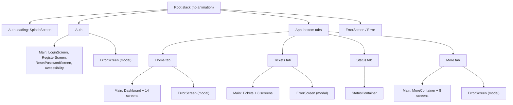

# Navigation

Source: `AppContainer` (module 1479), the signed-in navigators (1761), `TabBar` (1762), the "More"
menu (1846).

## The tree

The root stack holds three mutually exclusive states and moves between them with `reset`, so there
is never a way "back" from the app to the splash or from login to the app:

| Root route | Shown when |
|---|---|
| `AuthLoading` | On start and after sign-out, while the session is checked. See [startup-and-session.md](./startup-and-session.md). |
| `Auth` | No usable session. |
| `App` | Signed in. |
| `ErrorScreen`, `Error` | No connection, server error or service unavailable, from anywhere. |

Every tab, and the signed-out stack, is wrapped in an outer "extended" stack with two routes: `Main`
(the real stack) and `ErrorScreen` presented as a modal. That is why navigation calls in the code
look like `navigate('Home', {screen: 'Main', params: {screen: 'Cards'}})`. The helper
`buildNestedParams(['Main', 'Cards'])` builds the nested part.

## Routes

### Signed out (`Auth` → `Main`)

| Route | Screen | Document |
|---|---|---|
| `LoginScreen` | Login (initial) | [auth.md](./auth.md) |
| `RegisterScreen` | Registration | [auth.md](./auth.md) |
| `ResetPasswordScreen` | Request a reset link, or set the new password when opened from a link | [auth.md](./auth.md) |
| `Accessibility` | Accessibility declaration | [auth.md](./auth.md) |

### Home tab (`Home` → `Main`)

| Route | Screen | Document |
|---|---|---|
| `Dashboard` | Home (initial) | [home-and-status.md](./home-and-status.md) |
| `TimeTable` | Stop departures | [home-and-status.md](./home-and-status.md) |
| `Cards` | The user's mKKM card | [cards.md](./cards.md) |
| `CreateMkkmCard` | Create the mKKM card | [cards.md](./cards.md) |
| `CardTickets` | Tickets stored on a card | [cards.md](./cards.md) |
| `CardTicketReturn` | Return a card ticket (registered, but nothing navigates to it) | [cards.md](./cards.md) |
| `SubscriptionStatus51` | 5+1 subscription | [subscription-5plus1.md](./subscription-5plus1.md) |
| `BuyTicket51` | Buy a 5+1 ticket | [subscription-5plus1.md](./subscription-5plus1.md) |
| `TicketDetails`, `TicketBuy`, `TicketSummaryBuy`, `BanksList`, `TicketRefund`, `LineChange`, `InvoicesCreationForm` | The same screens as in the Tickets tab | below |

### Tickets tab (`Tickets` → `Main`)

| Route | Screen | Parameters | Document |
|---|---|---|---|
| `Tickets` | Ticket list (initial) | | [tickets.md](./tickets.md) |
| `TicketControl` | Control code | `ticketGuid` | [tickets.md](./tickets.md) |
| `TicketDetails` | Details | `transactionCode` | [tickets.md](./tickets.md) |
| `TicketRefund` | Return | the details object | [tickets.md](./tickets.md) |
| `LineChange` | Change the line | `ticket` | [tickets.md](./tickets.md) |
| `TicketBuy` | Purchase form | none, or `ticket` to extend / buy a similar one | [purchase.md](./purchase.md) |
| `TicketSummaryBuy` | Purchase summary | `data` (the price calculation) | [purchase.md](./purchase.md) |
| `BanksList` | Payment method | `id`, `isBuy`, `ticketData`, `ignoreWarnings`, callbacks | [purchase.md](./purchase.md) |
| `InvoicesCreationForm` | Create an invoice for a ticket | `ticket` | [account.md](./account.md) |

The ticket screens are registered in both the Home and the Tickets stack, so a ticket opened from a
card on Home stays inside the Home tab. `TicketControl` exists only in the Tickets stack.

`TicketBuy` has the swipe-back gesture switched off: the form has its own steps and handles "back"
itself.

### Status tab

One route, `StatusContainer`: the Karta Krakowska status. See
[home-and-status.md](./home-and-status.md).

### More tab (`More` → `Main`)

The stack is generated from a table, `RouteMore`, which is also the menu:

| Route | Menu label | Icon | Document |
|---|---|---|---|
| `MoreContainer` | (the menu itself, hidden from the list) | | [account.md](./account.md) |
| `MyProfile` | Moje konto | `user` | [account.md](./account.md) |
| `Invoices` | Faktury | `document` | [account.md](./account.md) |
| `Regulation` | Regulaminy | `file-contract` | [account.md](./account.md) |
| `Contact` | Kontakt | `envelope` | [account.md](./account.md) |
| `Accessibility` | Deklaracja dostępności | `list_file` | [auth.md](./auth.md) |
| `DeleteAccount` | Usuń konto | `exit` | [account.md](./account.md) |
| (action, not a route) | Wyloguj | `logout` | [startup-and-session.md](./startup-and-session.md) |

Two more routes are in the stack but not in the menu: `PreviewPdf` (an invoice, opened from the
invoice list) and `InvoiceCreation`, which nothing navigates to in this build.

## The tab bar

A custom component, 60 points high, white, with a one-pixel top border. Four tabs, each an icon
(25 pt) over a label:

| Tab | Label | Icon |
|---|---|---|
| `Home` | Start | `home` |
| `Tickets` | Bilety | `card` |
| `Status` | Status | `id` |
| `More` | Więcej | `more` |

The selected tab is blue (`$blue`), the others dark grey (`$trout`). Tabs are lazy (built on first
visit) and the system back button walks the tab history (`backBehavior: 'history'`).

Pressing a tab is not a plain switch:

- **Home** always navigates to `Dashboard`, so it also pops whatever was open in the Home stack.
- **Tickets** is gated on the mKKM card. Without `mkkmData`, or with `detached: true`, the tab does
  not open. An error dialog says "Podłącz kartę mKKM do swojego konta, aby zarządzać biletami", and
  closing it leads to `Home` → `Cards`.
- **Status** and **More** switch directly.

The tab bar also owns the screen brightness for the Status tab: while a Karta Krakowska control
code is on display and the Status tab is selected, it forces full brightness (after 300 ms), and it
restores the previous value when the tab changes or the app goes to the background.

## Transitions and headers

- Root stack: no animation. Every other stack: `fade_from_bottom`.
- Native headers are off everywhere (`headerShown: false`). Each screen draws its own header through
  `ParallaxHeader` (see [ui-kit.md](./ui-kit.md)): a back arrow with the title, on the blue
  background.
- The back arrow of a screen either goes back or, when the screen passes a route name as `target`,
  navigates to that route.
- Full-screen web content (tPay, stop departures) is not a route. It is a slide-up `Modal` over the
  current screen.

## Navigation that happens by itself

| Trigger | Result |
|---|---|
| Any request answers 401 | Sign-out, then `AuthLoading` → `Auth` |
| Any request answers 500 | `ErrorScreen` (server error) |
| Any request answers 503, or `service-status` says unavailable | `ErrorScreen` (service unavailable), which leaves by itself when the service is back |
| A request fails and the device is offline | `ErrorScreen` (no connection) |
| Payment finished in the WebView | `Tickets`, with a success dialog |
| Ticket control countdown reaches zero | Back to the ticket list |
| The app is opened from an activation or reset link | Handled on the login screen, see [auth.md](./auth.md) |
