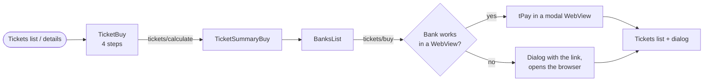

# Buying a ticket

Source: `TicketBuy` (module 1834), `SummaryBuy` (1837), `BanksListScreen` (1870), the tPay WebView
`Payment` (1871), the pending-payment store (721), `TicketElement` (1774).



## Entry points

| From | Parameter | Effect |
|---|---|---|
| The placeholder or the orange tile on the ticket list | none | Empty form |
| "Przedłuż bilet" / "Kup podobny" in ticket details | `ticket` | Form prefilled from that ticket |

## The purchase form (`TicketBuy`)

Title "KUP BILET", on the full blue page. Everything on the form is white on blue; selected options
are orange.

### What it loads

`tickets/ticket-sales-configuration/{customerCode}`, once per five minutes: the answer is cached in
`AsyncStorage` and reused within that time (the cache is deleted at sign-out). It contains everything
the form offers:

| Field | Used for |
|---|---|
| `specialTransportLines` | The ticket types of step 1, each flagged `isNetwork` or `isMetropolitan` |
| `ticketKinds` (`kinds`, `groups`) | The kinds of step 2 |
| `ticketPeriods` | The durations of step 3 |
| `ticketNumberOfLines` | The zones of step 4, with how many lines each allows |
| `priceListConfigurations` | Which kind, duration and zone combinations exist; everything else is disabled |
| `firstDayOfValidity`, `lastDayOfValidity` | The limits of the start date |

A failure here (an `exceptionCode` or a `message`) is shown as a dialog and the form stays empty.

An announcement can appear above the form: the app configuration may carry `salesViewAnnouncement`
with a text and a start and end date, shown in a lighter blue box while the current time is inside
that range.

### The steps

One step is visible at a time. Two buttons sit at the bottom: "COFNIJ" (disabled on the first step)
and "KONTYNUUJ". The hardware back button goes one step back, and leaves the form only from the
first step.

| Step | Heading | Content | Cannot continue without |
|---|---|---|---|
| 1 | Wybierz typ biletu: | One button per ticket type: a letter, the name ("Bilet …"), and an "Info" link that opens an alert with the type's description | A type |
| 2 | Wybierz rodzaj biletu: | One button per kind: a large letter (the first letter of the description) over the description in small print, for example **N** NORMALNY, **U** ULGOWY. A semester ticket, **S** SEMESTRALNY, is added when available. | A kind: "Proszę wybrać rodzaj biletu" |
| 3 | Wybierz długość biletu: | Duration chips ("1 MIES.", "2 MIES.", …, or the period's own description). Below, "Aktywny od" with the date and a white "ZMIEŃ" button. | A duration: "Proszę wybrać długość biletu" (not needed for the semester ticket) |
| 4 | Wybierz strefę: | A table of zones, then the line choice when the zone needs one | A zone: "Proszę wybrać strefę"; lines: "Proszę wybrać linie" or "Proszę wybrać więcej linii" |

**Step 1 is skipped** when the configuration offers only one type: it is selected silently and the
form opens on step 2.

**Step 3 details.**

- Chips for combinations with no price configuration are grey and do not react.
- Users with the resident's privilege see a notice about the Karta Krakowska discount applying to
  1, 2, 3-month and half-year tickets.
- The start date defaults to tomorrow. "ZMIEŃ" opens a date picker limited to the configuration's
  first and last day of validity.

**Step 4 details.** The zone table has four columns:

```
STREFY                     I     II    III
┌─────────────────────────────────────────┐
│ Sieciowy                 ✓     ✓     –  │
│ Jedna linia              🚋    –     –  │
│ Dwie linie               🚋    –     –  │
└─────────────────────────────────────────┘
```

The row labels above are illustrative; the real ones are the descriptions from the configuration.
Each row is a zone option with three marks, for the urban, the suburban and the second suburban
zone, taken from the number of lines the option covers there: nothing when it covers none, a vehicle
when it covers exactly one line, a tick otherwise. The selected row is orange, unavailable rows are
grey.

When the selected zone is for specific lines, a row "Wybrana linia" appears with a "ZMIEŃ" button
that opens the line search:

- Full-screen list titled "Wyszukaj linię/linie", numeric keypad, results from
  `dictionary/transport-line`.
- As many lines can be picked as the zone allows; picking fewer blocks the continue button.
- Each picked line that also runs in the second zone has a checkbox "II strefa".
- A picked line can be removed with a red cross. "Zapisz wybrane" closes the search.

### Prefilled form (extend / buy similar)

With a `ticket` parameter the form selects that ticket's type, kind, duration, zone and line, and
loads the line's data. It then skips ahead as far as the copied values allow; when every value could
be matched against the current configuration it appears to go straight to the price calculation.
The start date is limited differently:

| | Earliest | Latest |
|---|---|---|
| New ticket | Configuration's first day | Configuration's last day |
| Extension | The day after the old ticket expires | Thirty days after that |

If the old ticket has already expired, the default start is tomorrow.

### Price calculation

"KONTYNUUJ" on the last step posts the choice to `tickets/calculate`: start date, zone code, lines
(with their second-zone flags), ticket type, customer code, kind code and period code.

- Success → `TicketSummaryBuy` with the answer.
- Field errors → "Proszę poprawnie wybrać rodzaj i typ biletu".
- Anything else → the server's message. Messages the server is known to send here include "Można
  posiadać tylko 2 aktywne bilety w tym samym czasie." and "Bilet może być kupiony maksymalnie na 30
  dni przed okresem w którym zaczyna obowiązywać."

## Summary (`TicketSummaryBuy`)

Title "KUP BILET". Read-only, built entirely from the calculation.

- A warning box when the answer says `hasSimilarTicket`: "Posiadasz już podobny bilet obowiązujący
  częściowo w okresie na który chcesz kupić nowy bilet."
- The `TicketDates` card: lines, product name, valid from and to.
- Label and value pairs:

| Label | Value |
|---|---|
| Ważny | Days per week the ticket is valid: "7 dni w tygodniu" |
| Rodzaj biletu | The kind's description (or the semester label) |
| Strefa | The zone's description |
| Typ biletu | "Metropolitalny" or "Sieciowy", when the ticket is one of them |
| Obsługiwane linie | The lines, with ", 2 strefa" where the second zone was ticked |
| Cena | The price with a decimal comma and "zł" |

- Buttons: "Wybierz metodę płatności" → `BanksList`, and "ANULUJ" → back to the form.

Nothing has been bought at this point. The ticket is created when the user pays.

## Payment method (`BanksList`)

Title "Wybierz metodę płatności". Loads `payments/banks` and shows the payment groups as a grid of
logos. Tapping one marks it with a red border. "Zapłać" is disabled until one is chosen.

What "Zapłać" sends depends on whether the ticket exists yet:

| Situation | Request |
|---|---|
| First attempt from the summary | `POST tickets/buy` with the calculation, its id and the chosen payment group |
| Any later attempt, or "KONTYNUUJ PŁATNOŚĆ" on a pending ticket | `POST tickets/pay` with the ticket id, the payment group and `ignoreWarnings` |

The screen switches from the first to the second by itself once `tickets/buy` has succeeded, so
pressing "Zapłać" again after a failed or abandoned payment does not buy a second ticket.

Answers:

| Answer | Result |
|---|---|
| A payment URL | The payment opens (below) |
| `tickets/buy` fails | Error dialog with the server's message; its button leads to the ticket list |
| `tickets/pay`: code `AlreadyPaid` | The ticket list is reloaded |
| `tickets/pay`: code 5 | "Ponowienie płatności" warning (below) |
| `tickets/pay`: another code | Error dialog with the server's message |

**Repeat-payment warning.** A two-button dialog: "Ponowienie płatności" / "System oczekuje na
potwierdzenie poprzedniej płatności, czy na pewno chcesz ponowić płatność? Zapłać tylko jeżeli masz
pewność, że poprzednia płatność nie została sfinalizowana." "Zapłać" repeats the request with
`ignoreWarnings: true`; "Anuluj" closes it.

## Paying

Each payment group says whether it can run inside a WebView (`available_via_webview`).

**In the app.** A full-screen modal slides up with the tPay page. The app watches every URL the page
navigates to:

| The page reaches | The app |
|---|---|
| The payment's `returnUrl` | Remembers the ticket as "payment made", posts `Success` to `payments/result`, closes the modal |
| The payment's `returnErrorUrl` | Posts `Error` to `payments/result`, closes the modal |
| (the user closes the modal) | Treats it as cancelled |

**In the browser.** For groups that do not work in a WebView (bank apps, for example) a dialog says
"Wybrana płatność musi być kontynuowana poza aplikacją, w przeglądarce." and shows the link as
selectable text, with two buttons: "Przejdź do przeglądarki" (opens the link, then moves the app to
the ticket list and reloads it) and "Wróć do listy biletów". The app learns nothing about the
outcome; the ticket simply appears as pending or paid on the next reload.

**After an in-app payment** the ticket list is reloaded one second later, and:

| Outcome | Result |
|---|---|
| Success | → `Tickets`, success dialog "Płatność została zrealizowana. Dziękujemy" |
| Error | Error dialog "Wystąpił błąd, płatność została anulowana" |
| Cancelled | Error dialog "Płatność została anulowana" |

The button of the two error dialogs is "Wróć do listy biletów".

## Pending payments

A ticket whose payment has not been confirmed has the status `pending` and shows two buttons on its
card (see [tickets.md](./tickets.md#the-action-in-order-of-precedence)):

| Button | Does |
|---|---|
| KONTYNUUJ PŁATNOŚĆ | Opens `BanksList` for that ticket in "pay" mode. The user picks a method again. |
| SPRAWDŹ PŁATNOŚĆ | `POST payments/check` with the ticket id. A message from the server is shown as a dialog; without one the list is reloaded. |

Between a successful in-app payment and the server's confirmation, the card shows the disabled
"Trwa przetwarzanie płatności" instead, and the list polls every ten seconds. This is driven by the
locally remembered ticket id, so it only happens on the device that made the payment and only for
in-app payments.

## Things a new implementation has to preserve

- **Buy once, pay many times.** `tickets/buy` creates the ticket; every retry must use `tickets/pay`.
- **Report the WebView's outcome** to `payments/result`. The official client always does.
- **Do not assume a payment group works in a WebView.** Respect `available_via_webview`.
- **Offer only configured combinations.** The price list configuration, not the dictionaries, decides
  what can be bought.
- **Keep the 30-day rule for extensions** in the date picker rather than waiting for the server to
  refuse.
