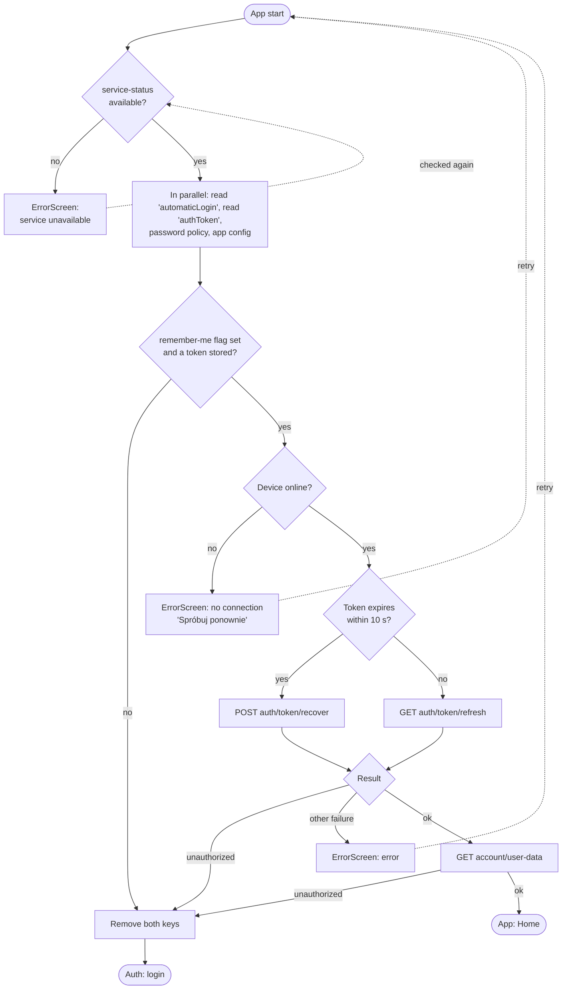

# Start-up and session

Source: `SplashScreen` (module 1693), the service status checker (1694), `ErrorScreen` (1695), the
API service (679), the update dialog (1647, 1669).

## Splash (`AuthLoading`)

Blue background with a full-screen background image, the logo (140 × 148) in the centre and a white
activity indicator below it. There is no text and no way to interact.

Points worth keeping in mind:

- The password policy and the app configuration are fetched before the session is even looked at,
  because the signed-out screens need them (the policy box on registration, the document links).
- "Remember me" is what makes a session survive a restart. The token is always stored at login, but
  on the next cold start it is only used when the flag `automaticLogin` is `true`. Without it the
  splash deletes the token and shows the login.
- The splash renews the token on every start, even a fresh one: `refresh` when it is still valid,
  `recover` when it has expired.
- "Retry" on an error screen pops it and replaces the splash with a new splash, which runs the whole
  sequence again.

## Service status

A small invisible component is mounted on the splash and stays responsible for `service-status`
afterwards:

- It asks on mount and every time the app returns to the foreground, but at most once every
  30 seconds.
- When the answer is `isAvailable: false`, it opens `ErrorScreen` with the type "service
  unavailable", the server's answer as the error, no back button, and a retry that is disabled for
  three seconds after each press.
- When a later check finds the service available again while that error screen is up, it closes the
  screen by itself.
- The API layer calls into the same component when any request answers 503.

## Session renewal during use

Every request builds its headers first, and building the headers renews the token when needed:

- More than ten minutes of validity left: nothing happens.
- Less than ten minutes left: `GET auth/token/refresh` with the device id and name.
- Already expired (appears to be: less than ten seconds left): `POST auth/token/recover` with the
  refresh token, device id and device name.

Both are single-flight: a second request arriving while a renewal is running waits for the same
promise. The renewed token is written back to secure storage.

The headers sent with every request are `X-Device-Id`, `X-Platform` (`android 34` style),
`X-Device-Name` (manufacturer and model), `X-Client-Version` and, when signed in, `Authorization`.

## What a failed request does

The API layer (`getError`) turns transport and status failures into navigation, so individual screens
rarely handle them:

| Failure | Result |
|---|---|
| 401 | Sign-out (below) |
| 500 | `ErrorScreen`, type "server error" |
| 503 | Service status check, then `ErrorScreen`, type "service unavailable" |
| Network failure, device offline | `ErrorScreen`, type "no connection" |
| Network failure, device online | Generic error returned to the screen |
| Any other status with a JSON body | Returned to the screen with `statusCode` added; the screen shows `message` |

## Error screen

One screen for all four types. Logo on the background image, then a white rounded card with:

- a bold grey title (24 pt, centred),
- an optional sub-message (14 pt, selectable),
- one button.

| Type | Title | Sub-message |
|---|---|---|
| No connection | Do obsługi aplikacji wymagane jest połączenie z internetem. | |
| Server error | Wewnętrzny błąd serwera – serwer napotkał niespodziewane trudności, które uniemożliwiły zrealizowanie żądania. | |
| Service unavailable | The server's message when it sent one, otherwise "Usługa tymczasowo niedostępna" | "Prosimy spróbować ponownie za kilka minut." when there is no server message |
| Error | Wystąpił nieznany błąd, spróbuj później. | |

The button text comes from the caller: "Spróbuj ponownie" when a retry was passed, otherwise "OK".
With a retry, pressing it shows a spinner for three seconds and then calls the retry. Without one,
it goes back, or exits the app when there is nothing to go back to. The hardware back button is
swallowed unless the caller allowed it (`backEnabled`).

## Forced and suggested updates

The login screen and Home both run the same check when they mount. It does not use the server: it
asks the store for the latest published version of the app and compares it with the installed one.

| Comparison | Result |
|---|---|
| Installed version is the latest or newer | Nothing |
| Major or minor number is behind | Blocking dialog: only "Aktualizuj" |
| Only the patch number is behind | Dialog with "Później" and "Aktualizuj" |

The text is "Wersja aplikacja mobilna KKM jest nieaktualna, do poprawnego działania wymagana jest
instalacja najnowszej aktualizacji dostępnej w sklepie Google Play" (or "App Store"). "Aktualizuj"
opens the store page. The dialog is shown once per run.

Separately, a few ticket strings refer to a server-driven requirement ("Wymagana aktualizacja
aplikacji aby kontynuować operacje", "Błąd pobrania kodu aztec. Pobierz nową wersję aplikacji"),
shown when an encrypted call cannot be completed with the key the app has.

## Sign-out

"Wyloguj" in the More menu, and every 401:

1. `POST auth/logout` with the device id (only when a token exists).
2. The token is dropped from memory and from secure storage.
3. The cached sales configuration is deleted.
4. The remember-me flag is removed and the root stack is reset to `Auth` (through `AuthLoading`).

There is no confirmation dialog. The Redux store is reset by the login screen when it mounts
(`resetState`), which is what clears the previous user's tickets and data.
