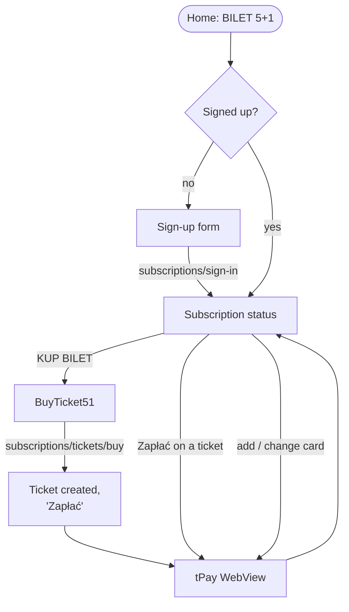

# The 5+1 subscription

Source: `SubscriptionStatus51Screen` (module 1845), `BuyTicket51Screen` (1842), `Payment51` (1843),
the 5+1 strings (1844).

5+1 is a six-month cycle of monthly tickets, paid one month at a time from a saved payment card, the
sixth month free. It is offered on Home to users with an attached mKKM card who have the resident's
privilege or already have a subscription (see [home-and-status.md](./home-and-status.md)).

Both screens use the full blue page with the title "BILET 5+1".



## What the status screen loads

On opening, and again every time it regains focus:

- `subscriptions/details`, `dictionary/city-card-types` and `subscriptions/available-actions`
  together,
- the storage media,
- `subscriptions/marketing-consents`.

`details.isSubscriptionSignedIn` decides which of the two states below is shown.

## Not signed up: the sign-up form

Heading "Zapisz się na subskrypcję biletu".

1. **Identity.** PESEL, or the birth date for accounts without one, and the e-mail. Each is
   prefilled from the user data and locked when the account already has a value.
2. **"Wybierz nośnik".** The user's cards as selectable panels: type name, owner's name, "Numer
   klienta", and for cards with the resident's status "Status Karty Krakowskiej:" with its dates.
   Cards without the status carry a red line "Ten nośnik nie posiada aktywnego statusu mieszkańca!".
   Only an mKKM card with an active resident's status can be chosen. Tapping any other gives the
   dialog "W aplikacji mobilnej można kupować bilety tylko dla nośników mKKM z aktywnym statusem
   mieszkańca". When exactly one card qualifies it is preselected.
3. **"Automatyczne odnawianie subskrypcji:"** with one checkbox: "Automatycznie ponawiaj subskrypcję
   po zakończonym cyklu 6-miesięcznym".
4. **Consents** from the server, as checkboxes. Required ones left empty show "Pole wymagane" after
   the first attempt.
5. **"ZAPISZ SIĘ"** → `POST subscriptions/sign-in` with the name, the chosen card, the consents and
   the renewal choice. Not choosing a card gives "Wybierz nośnik". Server errors appear as a dialog
   and under the affected fields. Success reloads the screen into the signed-up state.

## Signed up: the status

**A white card with the subscription's data**, each line a label and a bold value:

| Label | Value |
|---|---|
| (first line) | First and last name |
| Data urodzenia / Pesel: | Whichever the account has |
| Email: | |
| Numer klienta: | |
| Rodzaj karty: | The card type's name, from the dictionary |
| Numer karty płatniczej: | Masked number, when a payment card is saved |
| Początek subskrypcji: | Date and time |
| Automatyczne odnowienie subskrypcji: | Tak / Nie |
| Comiesięczne obciążenie karty: | Tak / Nie |

**Buttons under the data**, each shown only when `available-actions` or the details allow it:

| Button | Does |
|---|---|
| Odnawiaj automatycznie subskrypcję / Nie odnawiaj automatycznie subskrypcji | Opens a confirmation explaining the consequence (below), then `PUT subscriptions/edit` |
| DODAJ KARTĘ PŁATNICZĄ | `POST payments/add-payment-card`, then the returned tPay page in a WebView |
| ZMIEŃ DANE KARTY PŁATNICZEJ | `POST payments/change-payment-card`, then the tPay page |
| ANULUJ SUBSKRYPCJĘ | Confirmation "Czy na pewno chcesz anulować subskrypcję 5plus1 ?" (Tak / Nie), then `POST subscriptions/cancel`; success dialog "Subskrypcja została pomyślnie anulowana." |

The renewal confirmation spells out what the switch means:

- Turning it on: further tickets will be bought in a new 5+1 cycle when the current one ends.
  Button "Udziel zgodę".
- Turning it off: the subscription ends after the last ticket of the current cycle, and buying more
  needs a new sign-up. Button "Odwołaj zgodę".

Afterwards: "Zmieniono ustawienie automatycznej subskrypcji", or the server's message.

**Tickets.** Up to two ticket cards, the active one and the pending (future) one (the values in
the sketch are made up):

```
┌───────────────────────────────────────────┐
│ Aktywny bilet                             │   or "Przyszły bilet"
│ Ważny od          01.10.2026 00:00        │
│ Ważny do          31.10.2026 23:59        │
│ Bilet miesięczny sieciowy                 │   product name
│ Ilość miesięcy                 1          │
│ Cena                       80 zł          │
│ Obowiązuje        7 dni w tygodniu        │
│                              więcej →     │   → TicketDetails
│ [ USUŃ BILET ]            [ Zapłać ]      │
└───────────────────────────────────────────┘
```

| Button | Shown when | Does |
|---|---|---|
| USUŃ BILET | `canRemove` | Confirmation "Czy na pewno chcesz usunąć bilet?" (Tak / Nie), then `POST subscriptions/tickets/{ticketGuid}/remove` |
| Zapłać | `canBePaid`, and no payment was just made in this session | `POST subscriptions/tickets/pay`, then the tPay page |

"Zapłać" has the same repeat-payment guard as the normal purchase: when the server answers that an
earlier payment is still awaiting confirmation, the "Ponowienie płatności" warning appears and
"Zapłać" there repeats the request with `ignoreWarnings`.

With no tickets at all: "Brak aktywnych lub przyszłych biletów" and, when the action is available,
"KUP BILET" → `BuyTicket51`.

## Buying a subscription ticket (`BuyTicket51`)

Much simpler than the normal purchase form: the subscription fixes the zone and the period.

**Form:**

- A box: "Nie posiadasz jeszcze biletu w ramach subskrypcji. Wybierz rodzaj biletu oraz czas jego
  aktywacji."
- A warning when the card already holds a valid or future ticket: "Na karcie znajduje się ważny
  bilet lub bilet rozpoczynający ważność w przyszłości. Bilet od … do ….".
- Two kind buttons: **N** NORMALNY and **U** ULGOWY. Changing the kind reloads
  `subscriptions/tickets/buying-ticket-details` for that kind.
- "Aktywny od:" with tomorrow at midnight. The date cannot be changed, and a note says so: "Bilet
  zakupiony w ramach subskrypcji 5 plus 1 rozpoczyna swoją ważność od dnia jutrzejszego."
- "Nazwa:" with the product name and "Cena" with the price, both from the server.
- A checkbox: "Wyrażam zgodę na comiesięczne obciążanie mojej karty do końca trwania subskrypcji".
- "POTWIERDŹ" → `POST subscriptions/tickets/buy` with the kind, the consent and the start date.

**After the ticket is created** the form is replaced by its result: "Bilet:", "Cena:", "Aktywny od:",
"Aktywny do:", and two buttons: "Zapłać" (opens the returned tPay page) and "WRÓĆ DO LISTY".

## Payment

The 5+1 screens use their own copy of the tPay WebView. It differs from the normal one in how it
recognises the end: it matches the page's address against the success and error return addresses
from the app configuration (falling back to `payment/success` and `payment/rejected` under the
customer website), not against URLs sent with the payment. The outcome is posted to
`payments/result` in the same way.

| Outcome | Buying or paying a ticket | Adding or changing the card |
|---|---|---|
| Success | Płatność została zrealizowana. Dziękujemy | Karta płatnicza została zmieniona |
| Error | Wystąpił błąd, płatność została anulowana | Wystąpił błąd, podczas zmiany carty płatniczej |
| Cancelled | Płatność została anulowana | Proces zmiana karty został anulowany |

After a success the subscription is reloaded 1.5 seconds later, and the purchase screen goes back to
the status screen. Until that reload shows the new state, the "Zapłać" button on the ticket stays
hidden so that the same ticket is not paid twice.
