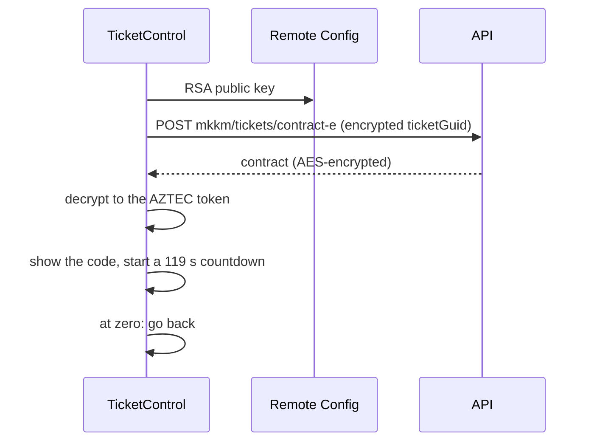
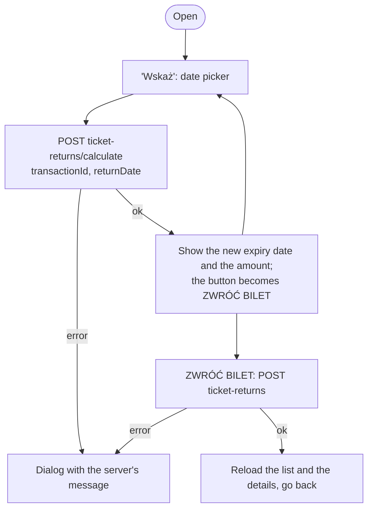

# Tickets

Source: `TicketsScreen` (module 1772), `TicketElement` (1774), the call-to-action tiles (1832, 1833),
`ControlComponents` (1835), `DetailsComponent` (1838), `TicketRefundScreen` (1839),
`LineChangeScreen` (1874), `TicketDates` (1526), the ticket strings (1773).

Buying is in [purchase.md](./purchase.md).

## Ticket list (`Tickets`)

Title "LISTA BILETÓW". The tab itself only opens with an attached mKKM card (see
[navigation.md](./navigation.md)).

**Loading.** On mount: the ticket list, the inhabitant status and the user data, plus the three
ticket dictionaries (kinds, periods, zones) and the app configuration. When the screen regains focus
the list is fetched again if the last fetch is more than two minutes old. Pull-to-refresh repeats the
first three.

**Content, top to bottom:**

1. When there are no tickets (and nothing is loading): a grey placeholder with a large icon, "BRAK
   AKTYWNYCH BILETÓW" and "Dotknij, aby kupić". Tapping it opens the purchase form.
2. One card per ticket.
3. Always, at the end: a large orange tile with a wallet icon, "KUP BILET" and "Dotknij, aby przejść
   do formularza", which opens the purchase form.

Both purchase entry points turn grey and show the dialog "Nie posiadasz statusu mkkm" when the user
has no mKKM card data.

The list comes from `mkkm/tickets/list` and is not filtered or grouped on the client: the order is
the server's.

## Ticket card

A white card cut like a paper ticket, with perforated left and right edges.

```
┌╌╌╌╌╌╌╌╌╌╌╌╌╌╌╌╌╌╌╌╌╌╌╌╌╌╌╌╌╌╌╌╌╌╌╌╌┐
╎ 🚋 [ 52 ]   🚋 [ 139 ]              ╎   one chip per line
╎ WAŻNY                              ╎
╎ OD 01.10.2026, 0:00 DO 31.10.2026, 23:59
╎ [   KONTROLA BILETÓW   ]    [ → ]  ╎   action + details
└╌╌╌╌╌╌╌╌╌╌╌╌╌╌╌╌╌╌╌╌╌╌╌╌╌╌╌╌╌╌╌╌╌╌╌╌┘
```

- **Line chips**: a vehicle icon and the line number in white on a dark rounded rectangle (22 pt
  bold). Line number 1000 is the code for "all lines" and is written "wszystkie linie". Tickets
  without specific lines appear to get a single chip "WSZYSTKIE" followed by the zone part of the
  zone dictionary's description.
- **Validity**: small grey capitals, "WAŻNY", then "OD" and "DO" with the dates as
  `DD.MM.YYYY, H:mm` in Kraków time.
- **Action button**: one of the states below, outlined style, filling the row.
- **Details button**: a small square button with an arrow, opening `TicketDetails` with the ticket's
  `transactionCode`. Disabled when the ticket has none.

### The action, in order of precedence

The first matching row wins.

| # | Condition | Button | Press |
|---|---|---|---|
| 1 | `assigned` | KONTROLA BILETÓW, disabled until the ticket's start date | → `TicketControl` with `ticketGuid` |
| 2 | `status` is `processing` | "Trwa przetwarzanie płatności", disabled, with a spinner | |
| 3 | `status` is `pending` | Two buttons side by side: KONTYNUUJ PŁATNOŚĆ and SPRAWDŹ PŁATNOŚĆ | See [purchase.md](./purchase.md#pending-payments) |
| 4 | `canAssign` | POWIĄŻ BILET | Assign to this device (below) |
| 5 | `status` is `returned` | BILET ZWRÓCONO, disabled | |
| 6 | otherwise | BILET POWIĄZANO | Error dialog: the ticket is already bound to two browsers or devices; use one of them or call the MPK helpline |

`processing` is partly a client-side state. After a payment succeeds in the WebView the app remembers
the ticket's id locally; while the server still reports that ticket as `pending`, the list shows it
as `processing` and reloads itself every ten seconds until the server catches up.

### Assigning a ticket to this device

1. The button shows a spinner.
2. The app obtains the RSA public key (Firebase Remote Config, cached in secure storage).
3. It encrypts `{id: ticketGuid, device_name}` and posts it to `mkkm/tickets/assign-e`.
4. On success the ticket list is reloaded and the card now offers "KONTROLA BILETÓW".
5. On failure: the server's message, or "Wystąpił błąd, podczas powiązywania biletu, spróbuj
   ponownie" when the key could not be obtained.

There is no confirmation before assigning, although a ticket can only be bound to two devices.

## Ticket control (`TicketControl`)

The screen shown to an inspector. Title "KONTROLA BILETÓW", back arrow, a short non-collapsing
header.

```
          (  photo  )            160 pt circle, light ring
        Jan KOWALSKI             35 pt, last name bold
      Numer klienta (mKKM)
           12345678
        ┌───────────┐
        │   AZTEC   │            up to 300 pt square, black on white
        └───────────┘
           01 : 59               countdown
```



- The whole screen is behind the header spinner until the code is ready.
- The code is drawn on the device from the decrypted token, not downloaded as an image.
- The countdown is fixed at 119 seconds from the moment the code appears, shown as `mm : ss`. At
  zero the screen closes itself. There is no "refresh code" control: the user opens the screen again.
- The customer code comes from the inhabitant status data, the name and photo from the user data.
- Three failures, each a dialog that returns to the list when closed:

| Failure | Text |
|---|---|
| Key unavailable | Wystąpił błąd, podczas pobierania klucza, spróbuj ponownie |
| Server refuses | The server's message |
| Decryption fails | Błąd pobrania kodu aztec. Pobierz nową wersję aplikacji |

Unlike the Karta Krakowska code, this screen does not raise the screen brightness.

## Ticket details (`TicketDetails`)

Title "SZCZEGÓŁY BILETU", on the full blue page with white text. Loads `tickets/{transactionCode}`.
If that fails, a dialog with the server's message and then back.

**Top:** the `TicketDates` card: line chips, the product name in bold, then "WAŻNY OD" and "WAŻNY DO"
as two rows with the dates right-aligned.

**Then a list of label and value pairs:**

| Label | Value |
|---|---|
| Zakupiony | Purchase date and time |
| Bilet opłacony | TAK / NIE |
| Typ płatności | Server's description |
| Stan płatności | Server's description |
| Stan transakcji | Server's description |
| Promocja | Name, or "-" |
| Historia stanów transakcji | Rows of date and state, when present |
| Historia stanów płatności | Rows of date and state, when present |
| Historia stanów zwrotu płatności | Rows of date and state, when present |
| Cena | Price with a decimal comma and "zł" |

When the ticket is bound to other devices and cannot be bound to this one, the "already bound to two
devices" text appears here too.

For each return already made: "Data dyspozycji zwrotu", "Ilość zwróconych dni", "Kwota zwrotu",
"Sposób zwrotu".

**Buttons at the end**, each only when the server allows it:

| Button | Condition | Leads to |
|---|---|---|
| ZWROT BILETU | `canReturn` | `TicketRefund` |
| Przedłuż bilet | `canBuyTheSame` and the ticket has not expired yet | `TicketBuy`, prefilled from this ticket |
| Kup podobny | `canBuyTheSame` and the ticket has expired | `TicketBuy`, prefilled from this ticket |
| ZMIEŃ LINIĘ | `canChangeLine` and the ticket is for specific lines (not line 1000) | `LineChange` |
| Pobierz fakturę | An invoice exists | Downloads the PDF, see [account.md](./account.md#invoices) |
| Utwórz fakturę | No invoice yet and `canGenerateInvoice` | `InvoicesCreationForm`, see [account.md](./account.md#creating-an-invoice-for-a-ticket) |

## Returning a ticket (`TicketRefund`)

Title "ZWROT BILETU". The screen receives the details object, so it opens without a request.

```
[ TicketDates card ]
┌ info ─────────────────────────────────────────────┐
│ Bilet jest ważny do końca dnia poprzedzającego     │
│ wybraną datę, a jeśli jego ważność już się         │
│ rozpoczęła, to co najmniej do końca bieżącego dnia.│
└────────────────────────────────────────────────────┘
Data zwrotu                 2026-10-15   [ Wskaż ]
Nowa data końca ważności    14-10-2026 23:59
Kwota zwrotu wynosi         42,50 zł
[        OBLICZ KWOTĘ ZWROTU  /  ZWRÓĆ BILET        ]
```



- The date picker is limited to the range from today (or the ticket's start date, if later) to the
  last returnable date sent by the server (`minExpireReturnDate`). Dates are whole days in Kraków
  time.
- Picking a date clears the previous amount and calculates the new one straight away.
- The single button changes with the state: "OBLICZ KWOTĘ ZWROTU" until an amount is on screen,
  "ZWRÓĆ BILET" afterwards.
- Pressing calculate without a date gives the dialog "Wybierz datę zwrotu".
- The return itself is not confirmed by a dialog: the amount on screen is the confirmation.

## Changing the line (`LineChange`)

For tickets valid on specific lines. Title "ZMIEŃ LINIĘ".

- A row "Wybrana linia" shows the current choice (or "Wybierz") and a white "ZMIEŃ" button.
- "ZMIEŃ" opens the line search: a full-screen list titled "Wyszukaj linię/linie" with a numeric
  keypad. Typing digits queries `dictionary/transport-line`; each result is a vehicle icon and the
  line number. One line can be chosen.
- "ZAPISZ" posts the ticket's transaction id and the chosen line (with its second-zone flag) to
  `tickets/line-change/edit`.
- Success: dialog "Pomyślnie zmieniono linię"; closing it reloads the details and goes back.
- Failure: the server's message, or "Proszę wybrac linię" when nothing was chosen.
